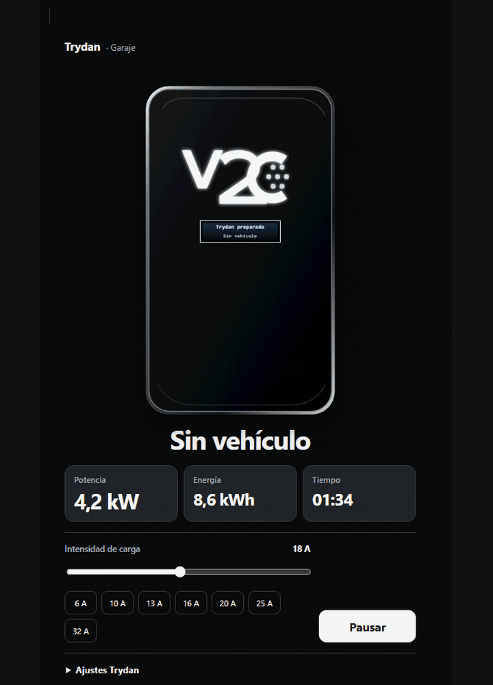

# ⚡ V2C Trydan Card

[English](README.md) · [Configuración](docs/CONFIGURATION.es.md) · [Guía visual](docs/VISUAL_GUIDE.es.md) · [Preguntas frecuentes](docs/FAQ.es.md)

Una tarjeta moderna para visualizar y controlar el cargador **V2C Trydan** desde el dashboard de Home Assistant. Usa las entidades de la [integración oficial V2C de Home Assistant](https://www.home-assistant.io/integrations/v2c/), tiene un editor traducido, controles visuales y datos en tiempo real en una sola card. Puedes instalarla mediante **HACS** o manualmente como Lovelace EV charger card.

> Proyecto personal compartido con la comunidad; no está afiliado ni respaldado por V2C y no sustituye la integración oficial.
>
> ⚠️ Úsala con responsabilidad: revisa las entidades y prueba los controles con seguridad antes de depender de ellos. Consulta la [licencia MIT](LICENSE).

## ✨ Características

- 🎛️ Monitoriza la carga y controla intensidad, pausa, bloqueo, temporizador, potencia dinámica y luces.
- 🌍 Tiene un editor visual y la pantalla LCD del cargador está disponible en 10 idiomas.
- 📐 Elige tamaño XXL, estándar, compacto o ultracompacto.
- 🖥️ Cambia entre layouts: automático, centrado, dividido y en línea.
- ⚡ Muestra potencia, intensidad, voltaje y energía de la sesión cuando existen entidades válidas.
- ☀️ Puedes mostrar el flujo energético; viene desactivado por defecto.
- 🔎 Descubre automáticamente las entidades del cargador mediante el registro de dispositivos, aunque sus nombres visibles sean distintos.
- 🎨 Personaliza el color del cargador con opciones predefinidas o con el color que tú quieras.
- ♿ Navega con teclado, foco visible, movimiento reducido y soporte de 280 a 768 px.

## 📐 4 modos de tamaño disponibles

<table>
  <tr>
    <th>XXL</th>
    <th>Estándar</th>
    <th>Compacta</th>
    <th>Ultracompacta</th>
  </tr>
  <tr>
    <td></td>
    <td></td>
    <td></td>
    <td></td>
  </tr>
</table>

Ultracompacta conserva estado, lecturas y controles esenciales, pero oculta intencionadamente la imagen del cargador. Puedes comparar los modos claro y oscuro en la [guía visual](docs/VISUAL_GUIDE.es.md#densidades).

## 🚗 GIF: de sin vehículo a cargando

La LCD localizada sigue la secuencia real: **Sin vehículo → Vehículo conectado → Cargando**.

## 🌍 Idiomas

Disponible en: 🇬🇧 Inglés · 🇮🇹 Italiano · 🇩🇪 Alemán · 🇫🇷 Francés · 🇳🇱 Neerlandés · 🇸🇪 Sueco · 🇩🇰 Danés · 🇳🇴 Noruego · 🇷🇴 Rumano · 🇪🇸 Español

## 💡 El porqué de este proyecto

Creé esta card de V2C Trydan para Home Assistant. Al buscar una tarjeta genérica para cargadores de vehículos eléctricos, las opciones que encontré no cubrían lo que necesitaba o parecían desactualizadas. Entonces decidí, con ayuda de IA, crear la mía propia para el cargador V2C Trydan: una card con la que puedo monitorizar y controlar el cargador.

La hice para mi dashboard y ahora que funciona quiero compartirla con la comunidad, por si también ayuda a otros usuarios de vehículo eléctrico.

— Marc ([@mactron254](https://github.com/mactron254))

## 🤖 Proyecto hecho con IA

Quiero explicar de forma transparente cómo se ha creado:

- Pensé el proyecto, indiqué la dirección y he probado los resultados con una instalación Trydan real.
- **Codex / OpenAI** ayudó con el desarrollo, las pruebas, la documentación y el material reproducible.
- Las decisiones de producto y la aceptación final siguen bajo dirección humana; la IA ha sido una ayuda importante durante el proyecto.

Consulta el registro de autoría en [CONTRIBUTORS.md](CONTRIBUTORS.md).

## 📦 Instalación con HACS

Si aún no aparece en el catálogo, añade <code>https://github.com/mactron254/v2c-trydan-card</code> como repositorio personalizado de tipo **Dashboard**. Instálala, recarga el navegador y añade la tarjeta desde el editor.

### Instalación manual

1. Descarga <code>v2c-trydan-card.js</code> desde la [última release](https://github.com/mactron254/v2c-trydan-card/releases/latest).
2. Copia el archivo en <code>/config/www/v2c-trydan-card.js</code>.
3. Añade <code>/local/v2c-trydan-card.js</code> como recurso JavaScript de tipo módulo.
4. Recarga Home Assistant.

## ⚙️ Configuración

Empieza con cualquier entidad perteneciente al dispositivo V2C. La tarjeta descubre los roles compatibles mediante metadatos estables del registro de dispositivos.

~~~yaml
type: custom:v2c-trydan-card
entity: binary_sensor.garaje_v2c_cargador_conectado
~~~

El editor visual incluye:

- **General:** dispositivo, idioma y comportamiento principal.
- **Apariencia:** tema, densidad, layout, color, escala y radio.
- **Contenido y orden:** métricas visibles, fuentes y orden de secciones.
- **Entidades:** descubrimiento mediante el registro de dispositivos o asignación manual.
- **Avanzado:** presets de amperaje, servicios y flujo energético opcional.

Activa el resumen energético sólo cuando lo quieras:

~~~yaml
show_energy_flow: true
~~~

El YAML existente desde v0.4.0 sigue siendo compatible. Ultracompacta conserva <code>show_charger</code> para que la ilustración vuelva al seleccionar otra densidad.

## 💬 Comunidad, feedback y soporte

- Usa [GitHub Discussions](https://github.com/mactron254/v2c-trydan-card/discussions) para ideas, preguntas, votaciones y ejemplos de dashboards.
- Abre una [Issue](https://github.com/mactron254/v2c-trydan-card/issues/new?template=bug_report.yml) para un error reproducible. Las ideas maduras de Discussions podrán convertirse después en Issues.
- Informa de vulnerabilidades de forma privada mediante [GitHub Security Advisories](https://github.com/mactron254/v2c-trydan-card/security/advisories/new).

Me encantará leer tu feedback, propuestas de funciones y correcciones. Antes de compartir registros o capturas, elimina identificadores de entidad, ubicaciones, SSID, direcciones IP privadas, tokens y cualquier dato personal.

## 📚 Documentación

- [Referencia completa de configuración](docs/CONFIGURATION.es.md)
- [Guía visual con 33 capturas reproducibles y cuatro GIF](docs/VISUAL_GUIDE.es.md)
- [FAQ y resolución de problemas](docs/FAQ.es.md)
- [Historial de cambios](CHANGELOG.md)
- [Guía para colaborar](CONTRIBUTING.md)
- [Borrador del foro en español](docs/FORUM_POST_ES.md) · [Borrador en inglés](docs/FORUM_POST_EN.md)

## 🧰 Desarrollo

Necesita Node.js 20+ y pnpm 11+. El repositorio está fijado a pnpm 11.5.1.

~~~powershell
corepack pnpm@11.5.1 install
corepack pnpm@11.5.1 check
corepack pnpm@11.5.1 docs:capture
~~~

## 📄 Créditos y licencia

La colaboración técnica se acredita a **Codex**, seguido del responsable del producto **Marc** ([@mactron254](https://github.com/mactron254)). Publicado con [licencia MIT](LICENSE).
