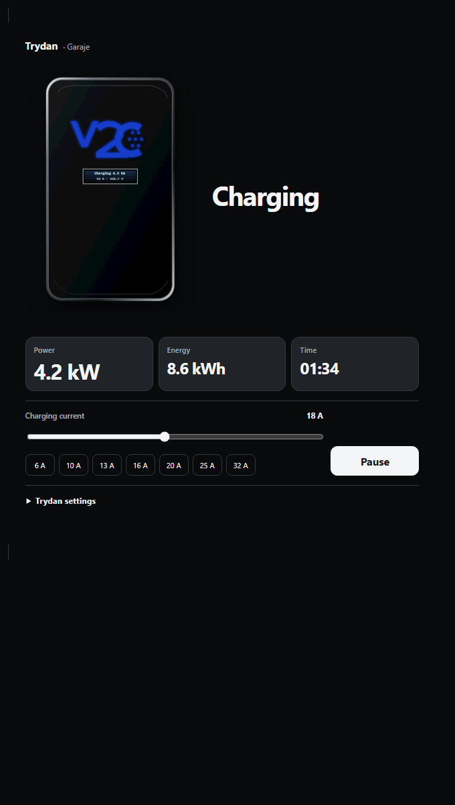
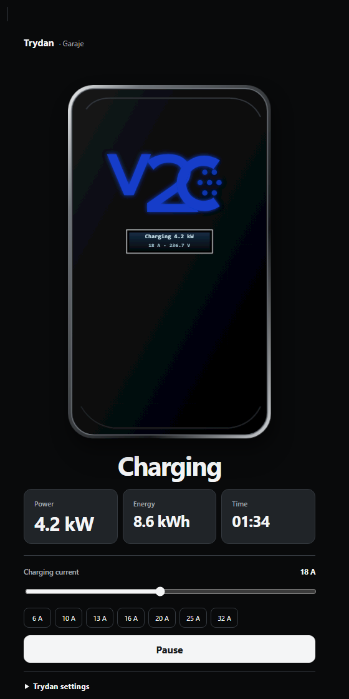
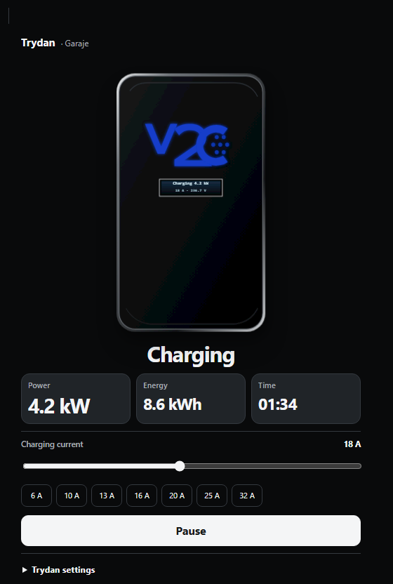
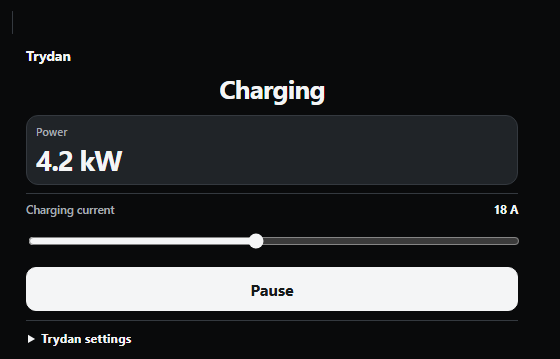
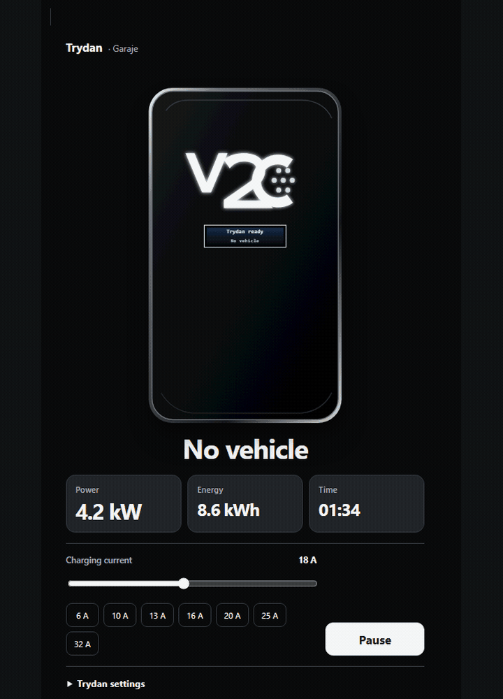

# ⚡ V2C Trydan Card

[Español](README.es.md) · [Configuration](docs/CONFIGURATION.md) · [Visual guide](docs/VISUAL_GUIDE.md) · [FAQ](docs/FAQ.md)

A modern card for viewing and controlling a **V2C Trydan** charger from the Home Assistant dashboard. It uses entities from the [official Home Assistant V2C integration](https://www.home-assistant.io/integrations/v2c/), with a translated editor, visual controls and real-time data in one card. Install it through **HACS** or manually as a Lovelace EV charger card.

> Personal project shared with the community. It is not affiliated with or endorsed by V2C, and it does not replace the official integration.
>
> ⚠️ Use it responsibly: review your entities and test controls safely before relying on them. See the [MIT license](LICENSE).

## ✨ Features

- 🎛️ Monitor charging and control current, pause, lock, timer, dynamic power and lighting.
- 🌍 Visual editor and charger LCD available in 10 languages.
- 📐 Choose XXL, standard, compact or ultra compact size.
- 🖥️ Switch between automatic, centered, split and inline layouts.
- ⚡ Show power, current, voltage and session energy when valid entities are available.
- ☀️ Energy flow can be shown; it is off by default.
- 🔎 Discover charger entities automatically through the device registry, even when their visible names differ.
- 🎨 Personalize charger colour with predefined options or any colour you choose.
- ♿ Navigate by keyboard with visible focus, reduced motion and support from 280 to 768 px.

## 📐 4 available sizes

<table>
  <tr>
    <th>XXL</th>
    <th>Standard</th>
    <th>Compact</th>
    <th>Ultra compact</th>
  </tr>
  <tr>
    <td></td>
    <td></td>
    <td></td>
    <td></td>
  </tr>
</table>

Ultra compact keeps status, readings and essential controls, but intentionally hides the charger image. Compare light and dark modes in the [visual guide](docs/VISUAL_GUIDE.md#densities).

## 🚗 GIF: from no vehicle to charging

The localized LCD follows the real sequence: **No vehicle → Vehicle connected → Charging**.

## 🌍 Languages

Available in: 🇬🇧 English · 🇮🇹 Italiano · 🇩🇪 Deutsch · 🇫🇷 Français · 🇳🇱 Nederlands · 🇸🇪 Svenska · 🇩🇰 Dansk · 🇳🇴 Norsk · 🇷🇴 Română · 🇪🇸 Español

## 💡 Why I created this project

I created this V2C Trydan card for Home Assistant. When I looked for a generic EV charger card, the options I found did not cover what I needed or looked outdated. So, with AI help, I decided to create my own card for the V2C Trydan: a card that lets me monitor and control the charger.

I made it for my dashboard and, now that it works, I want to share it with the community in case it helps other EV owners too.

— Marc ([@mactron254](https://github.com/mactron254))

## 🤖 Project made with AI

I want to explain transparently how it was made:

- I came up with the project, set the direction and tested the results on a real Trydan installation.
- **Codex / OpenAI** helped with development, tests, documentation and reproducible media.
- Product decisions and final acceptance remain human-led; AI has been an important help throughout the project.

See the contributor record in [CONTRIBUTORS.md](CONTRIBUTORS.md).

## 📦 Install with HACS

If the repository is not listed yet, add <code>https://github.com/mactron254/v2c-trydan-card</code> as a custom **Dashboard** repository in HACS. Install it, reload the browser and add the card from the dashboard editor.

### Manual installation

1. Download <code>v2c-trydan-card.js</code> from the [latest release](https://github.com/mactron254/v2c-trydan-card/releases/latest).
2. Copy it to <code>/config/www/v2c-trydan-card.js</code>.
3. Add <code>/local/v2c-trydan-card.js</code> as a JavaScript module under Dashboard resources.
4. Reload Home Assistant.

## ⚙️ Configuration

Start with any entity that belongs to the V2C device. The card discovers supported roles through stable device-registry metadata.

~~~yaml
type: custom:v2c-trydan-card
entity: binary_sensor.garage_v2c_charger_connected
~~~

The visual editor covers:

- **General:** device, language and primary behaviour.
- **Appearance:** theme, density, layout, accent, scale and card radius.
- **Content and order:** visible metrics, data sources and section order.
- **Entities:** device-registry discovery or explicit manual mappings.
- **Advanced:** amperage presets, services and optional energy flow.

Enable the energy summary only when wanted:

~~~yaml
show_energy_flow: true
~~~

Existing v0.4.0 YAML remains compatible. Ultra compact preserves <code>show_charger</code> so the illustration returns when another density is selected.

## 💬 Community, feedback and support

- Use [GitHub Discussions](https://github.com/mactron254/v2c-trydan-card/discussions) for ideas, questions, polls and dashboard examples.
- Open an [Issue](https://github.com/mactron254/v2c-trydan-card/issues/new?template=bug_report.yml) for a reproducible bug. Mature ideas from Discussions can later become Issues.
- Report vulnerabilities privately through [GitHub Security Advisories](https://github.com/mactron254/v2c-trydan-card/security/advisories/new).

I would love to hear your feedback, feature ideas and corrections. Before sharing logs or screenshots, remove entity IDs, locations, SSIDs, private IP addresses, tokens and any personal data.

## 📚 Documentation

- [Complete configuration reference](docs/CONFIGURATION.md)
- [Visual guide with 33 reproducible screenshots and four GIFs](docs/VISUAL_GUIDE.md)
- [FAQ and troubleshooting](docs/FAQ.md)
- [Changelog](CHANGELOG.md)
- [Contribution guide](CONTRIBUTING.md)
- [English forum draft](docs/FORUM_POST_EN.md) · [Spanish forum draft](docs/FORUM_POST_ES.md)

## 🧰 Development

Requires Node.js 20+ and pnpm 11+. The repository is pinned to pnpm 11.5.1.

~~~powershell
corepack pnpm@11.5.1 install
corepack pnpm@11.5.1 check
corepack pnpm@11.5.1 docs:capture
~~~

## 📄 Credits and license

Technical collaboration is credited to **Codex**, followed by product owner **Marc** ([@mactron254](https://github.com/mactron254)). Released under the [MIT license](LICENSE).
