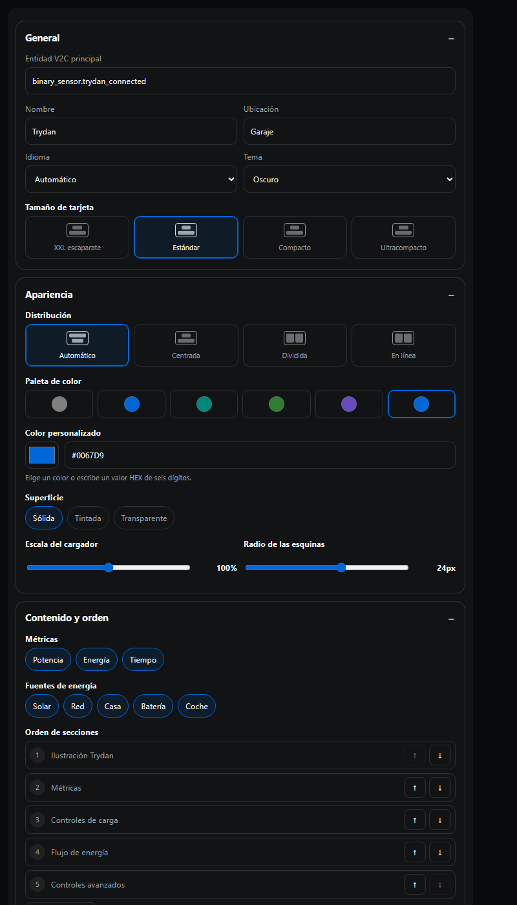

# Configuración

## Opciones principales

| Opción | Tipo | Default | GUI | Descripción |
|---|---|---|---|---|
| `entity` | string | requerida | Sí | Entidad semilla del dispositivo V2C |
| `name` | string | V2C Trydan | Sí | Título |
| `location` | string | — | Sí | Ubicación secundaria |
| `language` | código | idioma HA | Sí | Idioma de interfaz |
| `theme` | `auto`/`light`/`dark` | `auto` | Sí | Tema automático o forzado |
| `display_mode` | `xxl`/`standard`/`compact`/`ultra_compact` | `standard` | Sí | Densidad visual |
| `show_energy_flow` | boolean | `true` | Sí | Resumen energético inteligente |
| `show_controls` | boolean | `true` | Sí | Intensidad y pausa |
| `show_advanced` | boolean | `true` | Sí | Ajustes plegados |
| `show_charger` | boolean | `true` | Sí | Ilustración Trydan |

Idiomas: `en`, `it`, `de`, `fr`, `nl`, `sv`, `da`, `no`, `ro`, `es`.
Los locales `nb-NO` y `nn-NO` se asignan a noruego. Idiomas no soportados usan inglés.

## Opciones avanzadas YAML

| Opción | Tipo | Default | Descripción |
|---|---|---|---|
| `status_entity` | string | — | Sensor opcional con uno de los 11 estados visuales |
| `confirm_lock` | boolean | `true` | Confirmación antes de bloquear |
| `current_presets` | number[] | 6,10,13,16,20,25,32 | Atajos de amperios |
| `flow_threshold_w` | number | 50 | Umbral de reposo |
| `invert_grid_power` | boolean | `false` | Invierte signo de red |
| `invert_battery_power` | boolean | `false` | Invierte signo de batería |
| `invert_solar_power` | boolean | `false` | Invierte signo solar |
| `entities` | object | `{}` | Overrides explícitos de entidades |

## Ejemplos de densidad

```yaml
# Completa: Hero XL de 260–360 px, tres métricas, energía y controles
display_mode: standard

# Hero XL de 210–280 px; conserva estado, métricas y controles
display_mode: compact

# Hero XL de 170–220 px, estado, potencia y controles esenciales
display_mode: ultra_compact
```

Las cuatro densidades usan composición vertical centrada y límites fluidos seguros a 280 px. El modo ultracompacto mantiene la ilustración, el estado, la potencia, la intensidad y pausa; oculta presets y condensa el flujo. `show_charger: false` elimina la ilustración y su espacio, mientras el estado textual permanece visible.

## Overrides de entidad

```yaml
entities:
  connected: binary_sensor.garaje_v2c_cargador_conectado
  charging: binary_sensor.garaje_v2c_cargador_cargando
  ready: binary_sensor.garaje_v2c_cargador_listo
  charge_power: sensor.garaje_v2c_cargador_potencia_de_carga
  charge_energy: sensor.garaje_v2c_cargador_energia_de_carga
  charge_time: sensor.garaje_v2c_cargador_tiempo_de_carga
  house_power: sensor.garaje_v2c_cargador_energia_de_la_casa
  fv_power: sensor.garaje_v2c_cargador_energia_fotovoltaica
  battery_power: sensor.v2c_trydan_battery_power
  grid_power: sensor.v2c_trydan_grid_power
  voltage: sensor.v2c_trydan_voltage
  intensity: number.garaje_v2c_cargador_intensidad
  paused: switch.garaje_v2c_cargador_pausar_sesion
  locked: switch.garaje_v2c_cargador_bloquear_evse
  timer: switch.garaje_v2c_cargador_temporizador_de_punto_de_recarga
  dynamic: switch.garaje_v2c_cargador_modulacion_de_intensidad_dinamica
  pause_dynamic: switch.garaje_v2c_cargador_pausar_la_modulacion_de_control_dinamico
  logo_led: light.garaje_v2c_cargador_logo_led
  light_led: light.garaje_v2c_cargador_luz_led
  charge_mode: select.garaje_v2c_cargador_modo_de_carga
```

Override manual siempre gana. Si discovery encuentra varios candidatos, no elige silenciosamente: muestra el rol ambiguo.

## Estados visuales externos

Valores: `disconnected`, `charging`, `complete`, `timer`, `updating`, `control_pilot`,
`load_balancing`, `error`, `waiting_power`, `wifi_connected`, `wifi_connecting`.

## Convenciones de potencia

- Red positiva = importación.
- Batería positiva = descarga.
- Solar positiva = producción.
- Casa positiva = consumo.

```yaml
invert_grid_power: true
invert_battery_power: true
invert_solar_power: false
```

`W` y `kW` se normalizan. `unknown` y `unavailable` nunca se interpretan como cero.

## Resolución de problemas

- **No aparecen controles**: asocia entidades bajo `entities:`.
- **Flecha invertida**: activa el `invert_*_power` correspondiente.
- **Tema no coincide**: usa `theme: auto`; Home Assistant debe exponer sus variables de tema.
- **Card demasiado alta**: usa `display_mode: compact` o `ultra_compact`.
- **Estado inesperado**: revisa `status_entity`.
- **Card no carga**: confirma recurso tipo módulo y limpia caché del navegador.

## Novedades 0.4.0

`standard` es nueva densidad equilibrada. Para conservar Hero anterior usa `display_mode: xxl`. Añade `layout`, `color_scheme`, `accent_color`, `surface_style`, `hero_scale`, `card_radius`, `metrics`, `energy_sources`, `intensity_control`, `section_order`, `show_header`, `show_badges`, `show_presets` y `advanced_open`. `language: auto` resuelve configuración, locale HA, idioma HA, navegador e inglés.

## Estado 0.4.0 final

Editor agrupa General, Apariencia, Contenido y orden, Entidades y Avanzado. Los 26 roles indican `automatic`, `manual`, `ambiguous`, `invalid` o `missing`; una entidad inválida nunca habilita servicio.
## Editor visual 0.4.1

- **Métricas**: activa Potencia, Energía y Tiempo mediante chips.
- **Fuentes de energía**: activa Solar, Red, Casa, Batería y Coche.
- **Orden de secciones**: usa flechas; no escribas claves manualmente.
- **Intensidades rápidas**: añade amperios y elimina tokens existentes.
- **Color personalizado**: elige `Personalizado`, abre la paleta o escribe `#RRGGBB`.
- **Radio y escala**: sliders con resultado inmediato.
- **Layouts**: centrado vertical, dividido, en línea o automático responsive.



Consulta matriz completa en [VISUAL_GUIDE.md](VISUAL_GUIDE.md).
