# Guía visual v0.4.1

Capturas reproducibles con `corepack pnpm@11.5.1 docs:capture`. Todas usan SVG y datos locales del laboratorio.

## Densidades

| Modo | Claro | Oscuro |
|---|---|---|
| XXL | 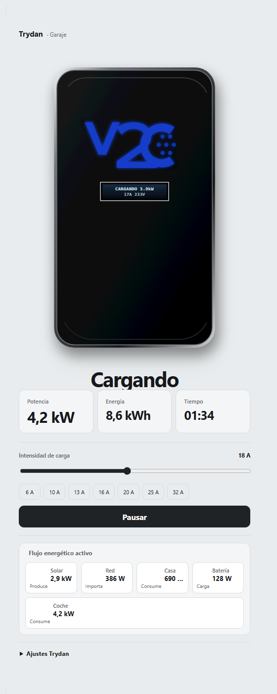 | 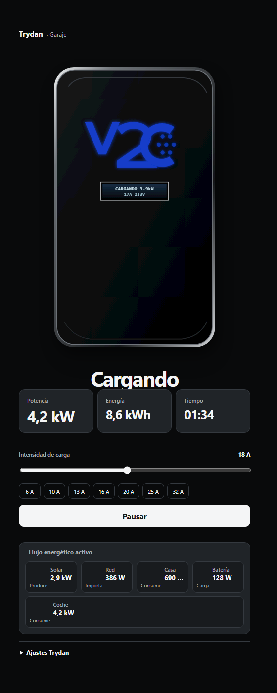 |
| Estándar | 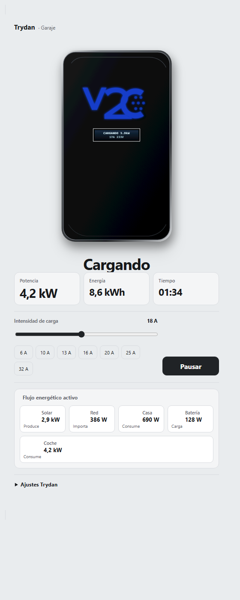 | 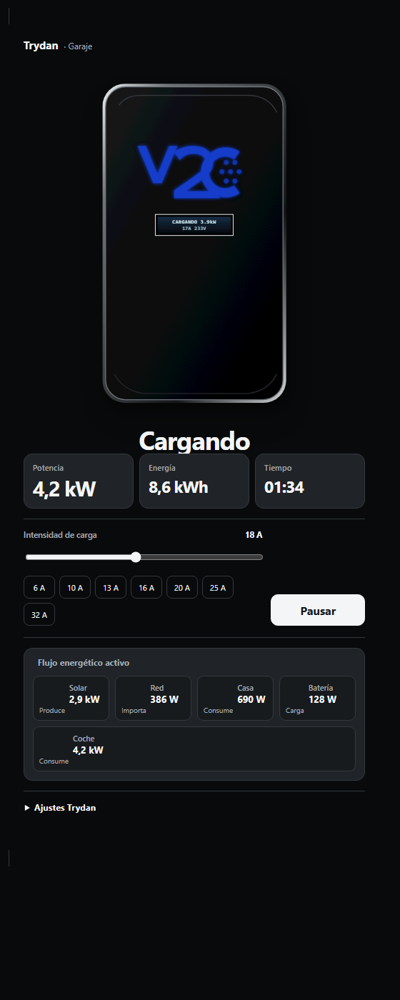 |
| Compacto | 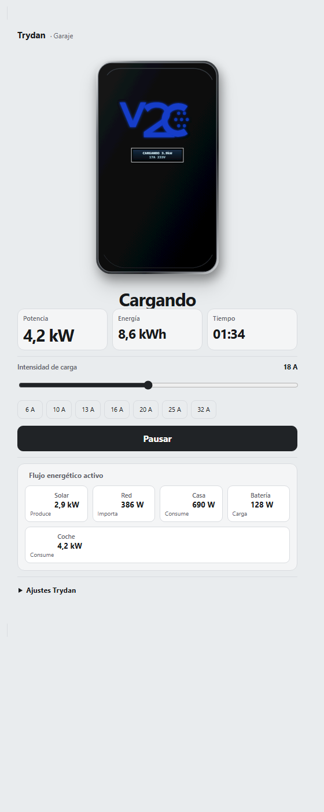 | 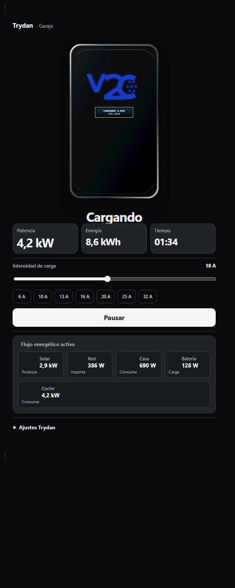 |
| Ultracompacto | 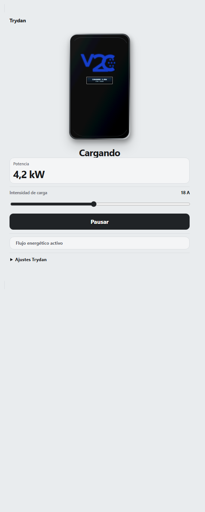 | 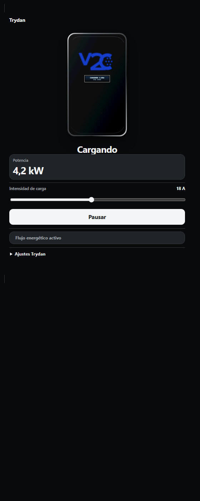 |

## Distribuciones

| Automática | Centrada |
|---|---|
|  | 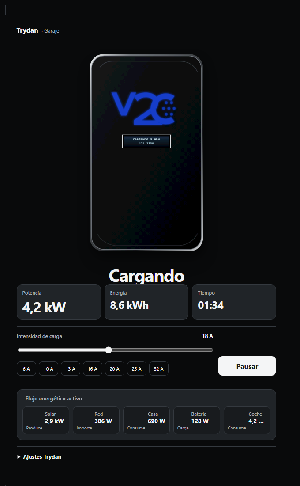 |

| Dividida | En línea |
|---|---|
| 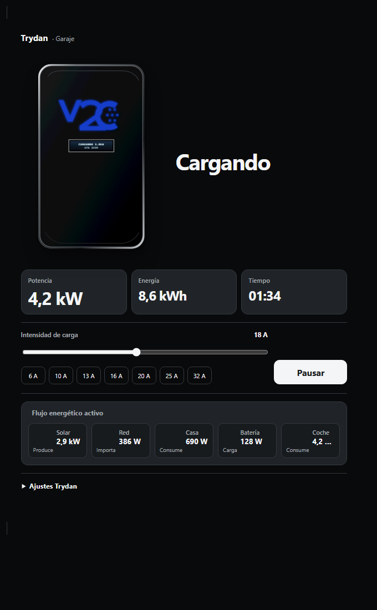 | 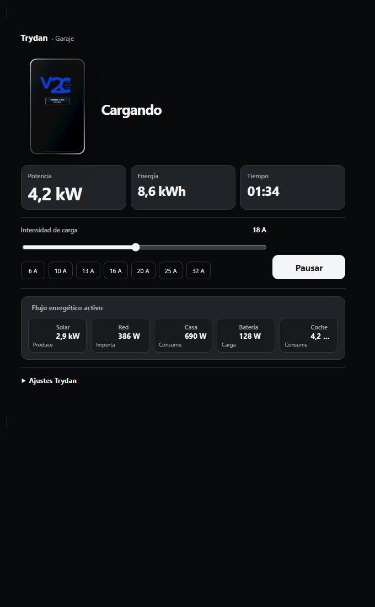 |

`split` e `inline` vuelven a composición centrada por debajo de 400 px. `auto` cambia a distribución dividida desde 520 px.

## Editor traducido

| Español | English |
|---|---|
|  | 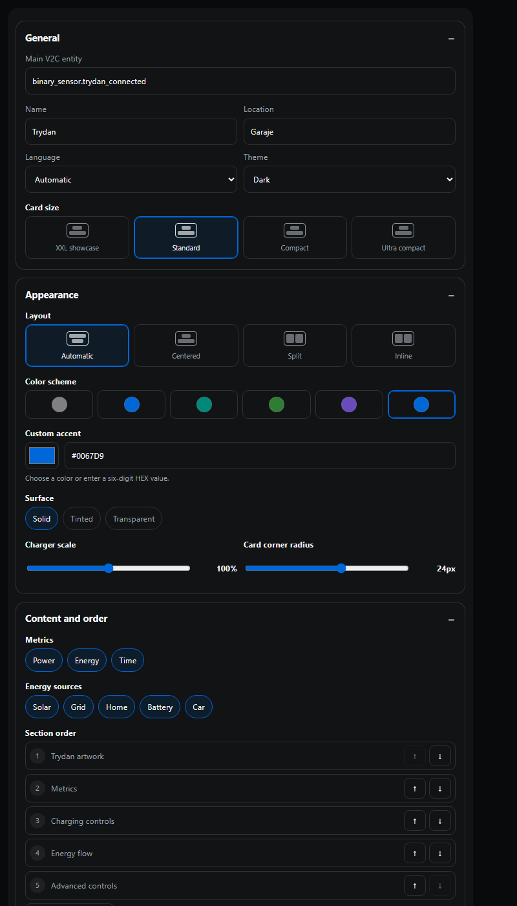 |

Editor usa controles visuales para densidad, layout, color, métricas, fuentes, orden, radio y presets. No requiere escribir listas CSV.
